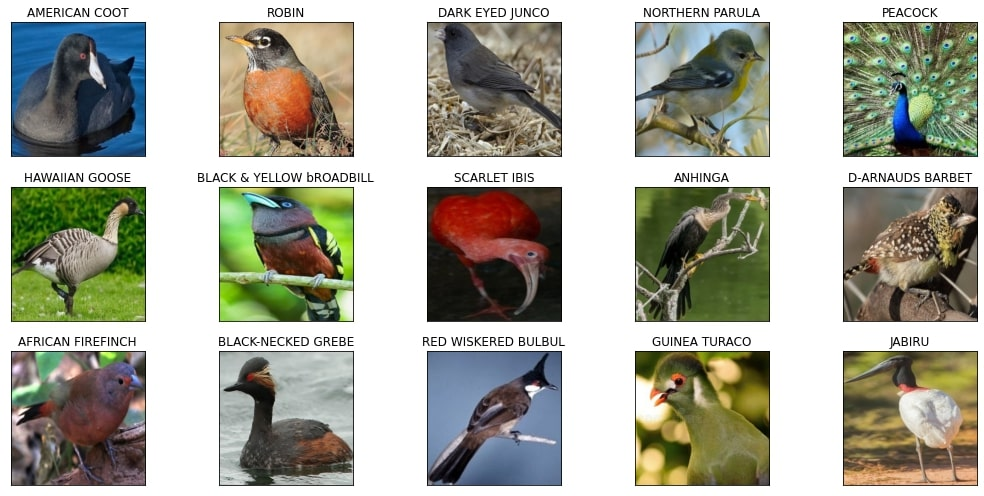
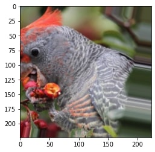
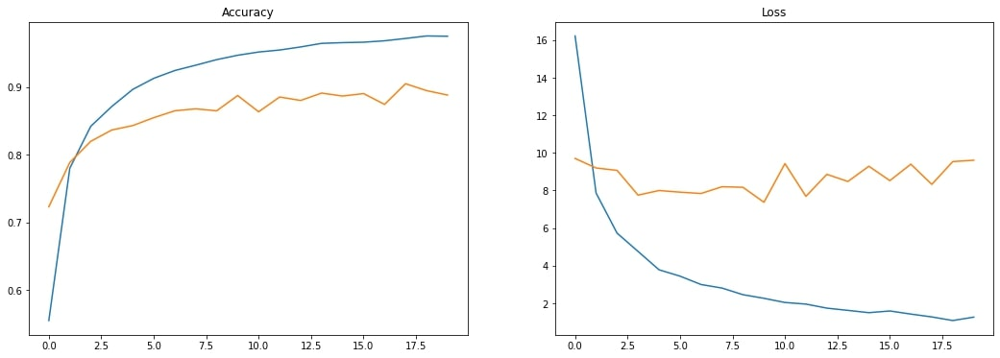
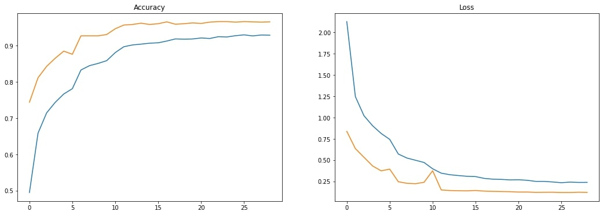
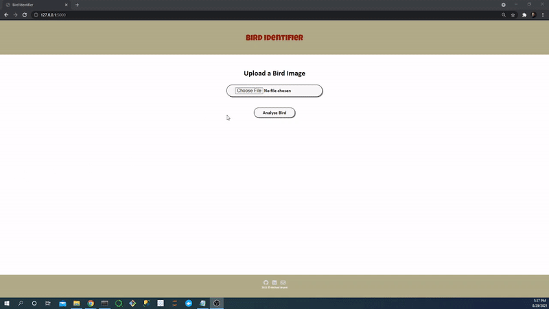

# Bird Identifier App

This repository is for the analysis of a bird images dataset, and the creation and deployment of a convolution neural network using the bird images. Below you will find an overview of the data, code, and results. The goal was to create an end-to-end project where I create a pipeline to perform an exploratory data analysis (EDA), image augmentation, create a convolution neural network to predict birds, and deploy a front-end on my local machine to productionize the neural network.

### Code Used 

**Python Version:** 3.7.10 <br />
**Packages:** pandas, numpy, matplotlib, tensorflow, keras, flask<br />
**For Web Framework Requirements:**  ```pip install -r requirements.txt```  

## Bird Images Dataset

The dataset was gathered from [Kaggle](https://www.kaggle.com/gpiosenka/100-bird-species). The dataset contains 275 different birds and 42,114 images.

### Birds

`AFRICAN CROWNED CRANE`, `AFRICAN FIREFINCH`, `ALBATROSS`, `ALEXANDRINE PARAKEET`, `AMERICAN AVOCET`, `AMERICAN BITTERN`, `AMERICAN COOT`, `AMERICAN GOLDFINCH`, `AMERICAN KESTREL`, `AMERICAN PIPIT`, `AMERICAN REDSTART`, `ANHINGA`, `ANNAS HUMMINGBIRD`, `ANTBIRD`, `ARARIPE MANAKIN`, `ASIAN CRESTED IBIS`, `BALD EAGLE`, `BALI STARLING`, `BALTIMORE ORIOLE`, `BANANAQUIT`, `BANDED BROADBILL`, `BAR-TAILED GODWIT`, `BARN OWL`, `BARN SWALLOW`, `BARRED PUFFBIRD`, `BAY-BREASTED WARBLER`, `BEARDED BARBET`, `BEARDED REEDLING`, `BELTED KINGFISHER`, `BIRD OF PARADISE`, `BLACK & YELLOW BROADBILL`, `BLACK FRANCOLIN`, `BLACK SKIMMER`, `BLACK SWAN`, `BLACK TAIL CRAKE`, `BLACK THROATED BUSHTIT`, `BLACK THROATED WARBLER`, `BLACK VULTURE`, `BLACK-CAPPED CHICKADEE`, `BLACK-NECKED GREBE`, `BLACK-THROATED SPARROW`, `BLACKBURNIAM WARBLER`, `BLUE GROUSE`, `BLUE HERON`, `BOBOLINK`, `BORNEAN BRISTLEHEAD`, `BORNEAN LEAFBIRD`, `BROWN NOODY`, `BROWN THRASHER`, `BULWERS PHEASANT`, `CACTUS WREN`, `CALIFORNIA CONDOR`, `CALIFORNIA GULL`, `CALIFORNIA QUAIL`, `CANARY`, `CAPE MAY WARBLER`, `CAPUCHINBIRD`, `CARMINE BEE-EATER`, `CASPIAN TERN`, `CASSOWARY`, `CEDAR WAXWING`, `CHARA DE COLLAR`, `CHIPPING SPARROW`, `CHUKAR PARTRIDGE`, `CINNAMON TEAL`, `CLARKS NUTCRACKER`, `COCK OF THE ROCK`, `COCKATOO`, `COMMON FIRECREST`, `COMMON GRACKLE`, `COMMON HOUSE MARTIN`, `COMMON LOON`, `COMMON POORWILL`, `COMMON STARLING`, `COUCHS KINGBIRD`, `CRESTED AUKLET`, `CRESTED CARACARA`, `CRESTED NUTHATCH`, `CROW`, `CROWNED PIGEON`, `CUBAN TODY`, `CURL CRESTED ARACURI`, `D-ARNAUDS BARBET`, `DARK EYED JUNCO`, `DOUBLE BARRED FINCH`, `DOWNY WOODPECKER`, `EASTERN BLUEBIRD`, `EASTERN MEADOWLARK`, `EASTERN ROSELLA`, `EASTERN TOWEE`, `ELEGANT TROGON`, `ELLIOTS  PHEASANT`, `EMPEROR PENGUIN`, `EMU`, `ENGGANO MYNA`, `EURASIAN GOLDEN ORIOLE`, `EURASIAN MAGPIE`, `EVENING GROSBEAK`, `FIRE TAILLED MYZORNIS`, `FLAME TANAGER`, `FLAMINGO`, `FRIGATE`, `GAMBELS QUAIL`, `GANG GANG COCKATOO`, `GILA WOODPECKER`, `GILDED FLICKER`, `GLOSSY IBIS`, `GO AWAY BIRD`, `GOLD WING WARBLER`, `GOLDEN CHEEKED WARBLER`, `GOLDEN CHLOROPHONIA`, `GOLDEN EAGLE`, `GOLDEN PHEASANT`, `GOLDEN PIPIT`, `GOULDIAN FINCH`, `GRAY CATBIRD`, `GRAY PARTRIDGE`, `GREAT POTOO`, `GREATOR SAGE GROUSE`, `GREEN JAY`, `GREEN MAGPIE`, `GREY PLOVER`, `GUINEA TURACO`, `GUINEAFOWL`, `GYRFALCON`, `HARPY EAGLE`, `HAWAIIAN GOOSE`, `HELMET VANGA`, `HIMALAYAN MONAL`, `HOATZIN`, `HOODED MERGANSER`, `HOOPOES`, `HORNBILL`, `HORNED GUAN`, `HORNED SUNGEM`, `HOUSE FINCH`, `HOUSE SPARROW`, `IMPERIAL SHAQ`, `INCA TERN`, `INDIAN BUSTARD`, `INDIAN PITTA`, `INDIGO BUNTING`, `JABIRU`, `JAVA SPARROW`, `KAKAPO`, `KILLDEAR`, `KING VULTURE`, `KIWI`, `KOOKABURRA`, `LARK BUNTING`, `LEARS MACAW`, `LILAC ROLLER`, `LONG-EARED OWL`, `MAGPIE GOOSE`, `MALABAR HORNBILL`, `MALACHITE KINGFISHER`, `MALEO`, `MALLARD DUCK`, `MANDRIN DUCK`, `MARABOU STORK`, `MASKED BOOBY`, `MASKED LAPWING`, `MIKADO  PHEASANT`, `MOURNING DOVE`, `MYNA`, `NICOBAR PIGEON`, `NOISY FRIARBIRD`, `NORTHERN BALD IBIS`, `NORTHERN CARDINAL`, `NORTHERN FLICKER`, `NORTHERN GANNET`,`NORTHERN GOSHAWK`, `NORTHERN JACANA`, `NORTHERN MOCKINGBIRD`, `NORTHERN PARULA`, `NORTHERN RED BISHOP`, `NORTHERN SHOVELER`, `OCELLATED TURKEY`, `OKINAWA RAIL`, `OSPREY`, `OSTRICH`, `OVENBIRD`, `OYSTER CATCHER`, `PAINTED BUNTIG`, `PALILA`, `PARADISE TANAGER`, `PARAKETT  AKULET`, `PARUS MAJOR`, `PEACOCK`, `PELICAN`, `PEREGRINE FALCON`, `PHILIPPINE EAGLE`, `PINK ROBIN`, `PUFFIN`, `PURPLE FINCH`, `PURPLE GALLINULE`, `PURPLE MARTIN`, `PURPLE SWAMPHEN`, `PYGMY KINGFISHER`, `QUETZAL`, `RAINBOW LORIKEET`, `RAZORBILL`, `RED BEARDED BEE EATER`, `RED BELLIED PITTA`, `RED BROWED FINCH`, `RED FACED CORMORANT`, `RED FACED WARBLER`, `RED HEADED DUCK`, `RED HEADED WOODPECKER`, `RED HONEY CREEPER`, `RED TAILED THRUSH`, `RED WINGED BLACKBIRD`, `RED WISKERED BULBUL`, `REGENT BOWERBIRD`, `RING-NECKED PHEASANT`, `ROADRUNNER`, `ROBIN`, `ROCK DOVE`, `ROSY FACED LOVEBIRD`, `ROUGH LEG BUZZARD`, `ROYAL FLYCATCHER`, `RUBY THROATED HUMMINGBIRD`, `RUFOUS KINGFISHER`, `RUFUOS MOTMOT`, `SAMATRAN THRUSH`, `SAND MARTIN`, `SCARLET IBIS`, `SCARLET MACAW`, `SHOEBILL`, `SHORT BILLED DOWITCHER`, `SMITHS LONGSPUR`, `SNOWY EGRET`, `SNOWY OWL`, `SORA`, `SPANGLED COTINGA`, `SPLENDID WREN`, `SPOON BILED SANDPIPER`, `SPOONBILL`, `SRI LANKA BLUE MAGPIE`, `STEAMER DUCK`, `STORK BILLED KINGFISHER`, `STRAWBERRY FINCH`, `STRIPPED SWALLOW`, `SUPERB STARLING`, `SWINHOES PHEASANT`, `TAIWAN MAGPIE`, `TAKAHE`, `TASMANIAN HEN`, `TEAL DUCK`, `TIT MOUSE`, `TOUCHAN`, `TOWNSENDS WARBLER`, `TREE SWALLOW`, `TRUMPTER SWAN`, `TURKEY VULTURE`, `TURQUOISE MOTMOT`, `UMBRELLA BIRD`, `VARIED THRUSH`, `VENEZUELIAN TROUPIAL`, `VERMILION FLYCATHER`, `VICTORIA CROWNED PIGEON`, `VIOLET GREEN SWALLOW`, `VULTURINE GUINEAFOWL`, `WATTLED CURASSOW`, `WHIMBREL`, `WHITE CHEEKED TURACO`, `WHITE NECKED RAVEN`, `WHITE TAILED TROPIC`, `WHITE THROATED BEE EATER`, `WILD TURKEY`, `WILSONS BIRD OF PARADISE`, `WOOD DUCK`, `YELLOW BELLIED FLOWERPECKER`, `YELLOW CACIQUE`, `YELLOW HEADED BLACKBIRD`

## Files

### app.py

This Python file contains is the back-end where the user input is processed and sent to the neural network for a prediction.

### bird-classification-inceptionresnetv2-part-1.ipynb

This Jupyter Notebook file contains the EDA, neural network baseline, and first attempt to increase the accuracy.

### bird-classification-inceptionresnetv2-part-2.ipynb

This Jupyter Notebook fie contains the final neural network training and evaluation.

### model.h5

This h5 file contains the weights for the neural network.

### model.json

This json file contains the architecture of the neural network.

## Results

### EDA

<div align="center">

<figure>
<br/>
  <figcaption>Figure 1: Displaying 15 images to take a look at the dataset.</figcaption>
</figure>

</div>

### Neural Network Building

The images were split into 39364 training images, 1375 validation images, and 1375 test images.

I decided to use transfer learning, so I tested several different pre-trained models and assessed them based on accuracy. I used early stopping to prevent overfitting. The output layer had 275 units with a softmax activation function. The best pre-trained model was Inception ResNet V2. For this model, I used the sequential API.

I then implemented image augmentation, because the model was fitting the training set faster than the validation set. An example of this is shown in Figure 2.

<div align="center">

<figure>
<br/>
  <figcaption>Figure 2: An example of an image after image augmentation.</figcaption>
</figure>

</div>

<br/>

After this, I experimented with different amounts of additional hidden layers and number of neurons. I found that adding one wide additional layer improved accuracy over multiple additional hidden layers. The number of neurons which was best was 1950 in a single layer. I used batch normalization to improve the performance through regularization.

Lastly, the validation accuracy plateaued around 90%, but I prevented this by reducing the learning rate each time a plateau occurred. 

### Neural Network Performance

The initial (baseline) test performance with just the pre-trained model and flattening was 0.8996 accuracy and 8.3979 loss. The training and validation performance for this first neural network is shown in Figure 3.

<div align="center">

<figure>
<br/>
  <figcaption>Figure 3: Training (blue) and validation (orange) performance for accuracy and loss for the first baseline training.</figcaption>
</figure>

</div>

<br/>

After adding an additional hidden layer with 1950 neurons, batch normalization, and image augmentation, I was able to increase the test accuracy by 6.91% and decrease the loss by 8.2898. The training and validation performance for the final neural network is shown in Figure 4.

<div align="center">

<figure>
<br/>
  <figcaption>Figure 4: Training (blue) and validation (orange) performance for accuracy and loss during the final training.</figcaption>
</figure>

</div>

<br/>

Final test performance for the neural network:
* **Accuracy:** 0.9687
* **Loss:** 0.1081

## Productionization

I built a front-end to run on my local machine which takes photos of birds as input from the user and outputs a bird prediction using a convolution neural network.

<div align="center">

<figure>
<br/>
  <figcaption>Figure 5: Deploying app with Flask on my local machine.</figcaption>
</figure>

</div>

## Resources

1. [Kaggle: Bird photos dataset](https://www.kaggle.com/gpiosenka/100-bird-species)
2. [GitHub: krishnaik06/Deployment-Deep-Learning-Model](https://github.com/krishnaik06/Deployment-Deep-Learning-Model)
3. [EZGIF.COM](https://ezgif.com/)
